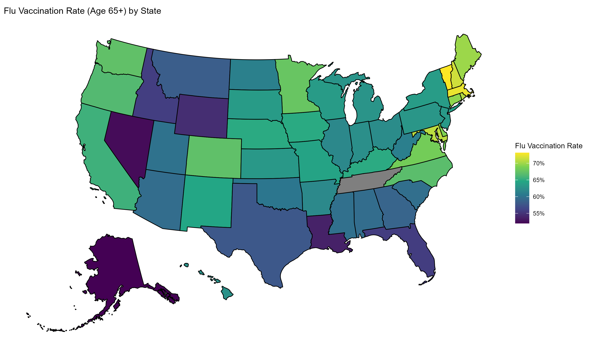

# BRFSS Healthcare Access Analysis
**Author:** Brandon Rugg  
**LinkedIn:** https://www.linkedin.com/in/your-link  
**GitHub:** https://github.com/ruggbk

April 2026

**Description**  
This project analyzes healthcare access and preventive care patterns in the United States using the 2022 Behavioral Risk Factor Surveillance System (BRFSS). The focus is on flu vaccination coverage among adults aged 65+, with comparisons across demographic groups and geographic regions.

[View the BRFSS Data Exploration Notebook](https://ruggbk.github.io/BRFSS_HealthcareAccess_Analysis/BRFSS_DataExploration.nb.html)

[Seasonal influenza](https://www.cdc.gov/flu/highrisk/65over.htm) poses a significant health risk for older adults, who account for the majority of flu-related hospitalizations and deaths. In recent years, individuals aged 65 and older have represented approximately 70–85% of influenza-related deaths and over half of hospitalizations in the United States. As a result, flu vaccination is a key preventive measure and a widely used indicator of healthcare access and utilization in this population.

## Key Questions
- How does flu vaccination coverage vary across U.S. states?
- Are there differences in vaccination rates by sex, race/ethnicity, or urban vs. rural status?
- What patterns suggest disparities in healthcare access among older adults?

## Data
- Source: CDC Behavioral Risk Factor Surveillance System (BRFSS), 2024
- Population: U.S. adults aged 65+
- Methodology: Survey-weighted estimates using the `survey` package in R

## Methods
- Cleaned and recoded survey variables (vaccination status, demographics, geography)
- Constructed survey design objects to account for complex sampling (weights, strata, PSUs)
- Estimated subgroup vaccination rates using weighted means and 95% confidence intervals
- Aggregated results by:
  - State
  - Sex
  - Race/ethnicity
  - Urban vs. rural status

## Results

### Geographic Variation

Flu vaccination rates among adults aged 65+ vary substantially across states, ranging from ~73% in Vermont to ~52% in Alaska among U.S. states (excluding territories with smaller samples).

Higher vaccination rates are concentrated in the Northeast, where several states exceed 70%. In contrast, lower rates are more common in the South and parts of the Mountain West, with many states below 60%.

Overall, the spread between the highest and lowest states is over 20 percentage points, indicating meaningful geographic disparities in preventive healthcare uptake.

Estimates for U.S. territories show greater variability and wider confidence intervals, reflecting smaller sample sizes and increased uncertainty. Flu vaccination rates nonetheless appear quite low, with ~44% for Puerto Rico and ~31% for the Virgin Islands.

### Demographic Differences

**Sex**
| Category | Flu Shot Rate   | 95% CI       |
|----------|-----------------|--------------|
| Male     | 61.1%           | (60.2–62.0%) |
| Female   | 63.6%           | (62.8–64.5%) |

**Urban vs. Rural**
| Category | Flu Shot Rate   | 95% CI       |
|----------|-----------------|--------------|
| Urban    | 63.2%           | (62.6–63.9%) |
| Rural    | 56.2%           | (54.7–57.7%) |

**Race/Ethnicity**
| Category                     | Flu Shot Rate | 95% CI         |
|-----------------------------|---------------|----------------|
| White (Non-Hispanic)        | 65.0%         | (64.4–65.6%)   |
| Black (Non-Hispanic)        | 57.0%         | (54.7–59.2%)   |
| Other Race (Non-Hispanic)   | 59.3%         | (55.4–63.1%)   |
| Multiracial (Non-Hispanic)  | 56.0%         | (51.1–61.0%)   |
| Hispanic                    | 54.8%         | (51.9–57.7%)   |

Flu vaccination rates among adults 65+ show modest differences by sex but larger disparities across geography and race/ethnicity.

Females have slightly higher vaccination rates than males (~63.6% vs. ~61.1%), though the difference is relatively small. In contrast, a more substantial gap appears between urban and rural populations, with urban residents (~63.2%) exceeding rural residents (~56.2%) by about 7 percentage points.

The largest disparities are observed across race and ethnicity. White non-Hispanic individuals have the highest vaccination rate (~65.0%), while Hispanic (~54.8%) and multiracial (~56.0%) populations have the lowest. Black non-Hispanic (~57.0%) and other non-Hispanic groups (~59.3%) fall in between. Overall, the spread between the highest and lowest groups is approximately 10 percentage points.

Taken together, these patterns suggest that structural and access-related factors, reflected in geography and race/ethnicity, are more strongly associated with vaccination uptake than sex.

## Key Takeaways

- Flu vaccination coverage among adults 65+ varies widely across states, with a >20 percentage point gap between the highest and lowest.
- Disparities by sex are relatively small (~2–3 percentage points), while larger gaps exist by urban/rural status (~7 percentage points) and race/ethnicity (~10 percentage points).
- Lower vaccination rates are concentrated in rural areas and among certain racial/ethnic groups, suggesting differences in healthcare access and preventive care utilization.

## Next Steps

- Model vaccination uptake as a function of socioeconomic and geographic variables
- Explore interactions (e.g., race/ethnicity × rural status)
- Incorporate additional years of BRFSS data to analyze trends over time
